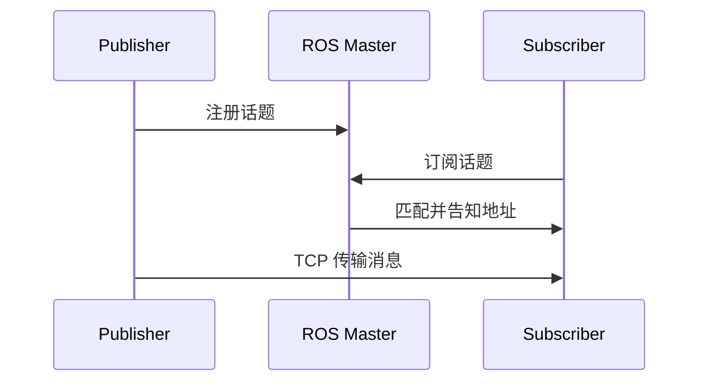

本章命令速查见文末 [附录：命令速查](#5-附录命令速查)。通信机制总对比见 [系列索引](ros-tutorial-index.md#3-三种通信机制对比)。

## 0. 本章你要学什么

> 更新：2026-06-04

---

**本章解决什么问题**：传感器、控制指令等**连续数据**如何在节点间传递。

**学完能做什么**：编写 Publisher / Subscriber，定义自定义 msg，用 `rostopic` 调试。

**对应仓库**：`src/topic/`

### 核心概念

话题通信 = **发布-订阅**，异步、单向、适合数据流。

| 对比 | Topic | Service |
|------|-------|---------|
| 模式 | 发布-订阅 | 请求-响应 |
| 数据 | 连续流 | 一次一问一答 |
| 典型 | 雷达、速度指令 | 计算、查询 |



---

## 1. 场景一：理解话题通信流程

#### 场景

激光雷达节点持续发点云，导航节点订阅处理——这就是 Topic。

#### 实操

实现流程（6 步）：

1. **Talker 注册**：发布者向 Master 注册话题名  
2. **Listener 注册**：订阅者向 Master 注册要订阅的话题  
3. **Master 匹配**：Master 配对双方  
4. **Listener 请求连接**：订阅者向发布者发 TCP 连接请求  
5. **Talker 确认**：发布者返回地址  
6. **传消息**：建立 TCP 后直接通信（此后可关闭 Master，通信仍继续）

#### 小结

- 发布者与订阅者启动顺序无要求，但**后连上的订阅者可能丢早期消息**（可在发布前 `sleep` 几秒缓解）。
- 一个话题可有多个发布者、多个订阅者。

---

## 2. 场景二：运行仓库示例

#### 场景

快速验证 Topic 是否工作。

#### 实操

```bash
cd ~/ros && catkin_make && source devel/setup.bash
```

终端 1：`roscore`  
终端 2：`rosrun topic advertiser`（或 `advertiser.py`）  
终端 3：`rosrun topic subscriber`（或 `subscriber.py`）

命令行调试：

```bash
rostopic list
rostopic echo /chat
rostopic pub /chat std_msgs/String "data: 'hello'"
```

#### 小结

话题名必须一致；用 `rostopic list` 核对实际名称。

---

## 3. 场景三：自定义消息类型（msg）

#### 场景

标准 `std_msgs` 不够用，需要自定义结构。

#### 实操

在功能包下创建 `msg/Person.msg`：

```txt
string name
uint16 age
float64 height
```

**package.xml** 添加：

```xml
<build_depend>message_generation</build_depend>
<exec_depend>message_runtime</exec_depend>
```

**CMakeLists.txt** 添加：

```cmake
find_package(catkin REQUIRED COMPONENTS roscpp rospy std_msgs message_generation)

add_message_files(FILES Person.msg)

generate_messages(DEPENDENCIES std_msgs)

catkin_package(CATKIN_DEPENDS roscpp rospy std_msgs message_runtime)
```

编译后使用：

```cpp
#include "topic/Person.h"   // C++
```

```python
from topic.msg import Person  # Python
```

#### 小结

msg 定义 → 改 package.xml + CMakeLists.txt → `catkin_make` → 引用生成的头文件/模块。

---

## 4. 场景四：编写 Publisher / Subscriber

#### 场景

从零写一个最小话题通信对。

#### 实操

**Publisher（C++ 要点）**：

```cpp
ros::init(argc, argv, "talker");
ros::NodeHandle nh;
ros::Publisher pub = nh.advertise<std_msgs::String>("chat", 10);
ros::Rate rate(10);
while (ros::ok()) {
    std_msgs::String msg;
    msg.data = "hello";
    pub.publish(msg);
    rate.sleep();
}
```

**Subscriber（C++ 要点）**：

```cpp
void cb(const std_msgs::String::ConstPtr& msg) {
    ROS_INFO("%s", msg->data.c_str());
}
ros::Subscriber sub = nh.subscribe("chat", 10, cb);
ros::spin();
```

#### 小结

Publisher 用循环 + `publish`；Subscriber 用回调 + `spin()`。详见 [08 API 参考](ros-08-apis-reference.md) 中 spin 说明。

---

## 5. 附录：命令速查

| 命令 | 说明 |
|------|------|
| `rostopic list` | 列出话题 |
| `rostopic echo 话题名` | 监听话题 |
| `rostopic pub 话题名 类型 数据` | 手动发布 |
| `rostopic info 话题名` | 查看发布者/订阅者 |
| `rqt_graph` | 可视化通信图 |

---

## 系列导航

- **上一章** ← [02 工作空间](ros-02-workspace.md)
- **下一章** → [04 服务通信](ros-04-service.md)

---
