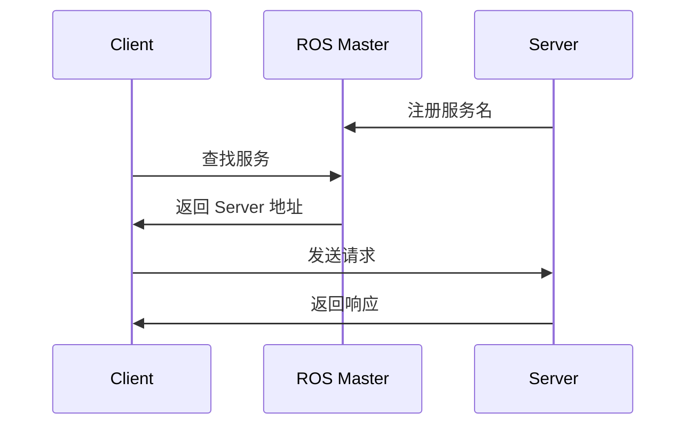

本章命令速查见文末 [附录：命令速查](#5-附录命令速查)。

## 0. 本章你要学什么

> 更新：2026-06-04

---

**本章解决什么问题**：需要**同步**完成一次计算或查询，而不是持续发数据。

**学完能做什么**：编写 Server / Client，定义 srv，用 `rosservice call` 测试。

**对应仓库**：`src/services/`

### 核心概念

| 对比 | Topic | Service |
|------|-------|---------|
| 模式 | 发布-订阅（异步） | 请求-响应（同步） |
| 流向 | 单向 | 双向 |
| 场景 | 传感器流、控制流 | 加法、状态查询、触发动作 |



---

## 1. 场景一：理解服务通信流程

#### 场景

客户端问「3+4 等于几」，服务端算完返回 7。

#### 实操

5 步流程：

1. Server 向 Master 注册服务名  
2. Client 向 Master 注册要调用的服务名  
3. Master 匹配并告知 Client Server 地址  
4. Client 通过 TCP 发送请求  
5. Server 处理并返回响应  

#### 小结

- 客户端会**阻塞等待**响应。
- 服务端必须先启动，或 Client 用 `waitForService()` 等待。

---

## 2. 场景二：运行仓库示例

#### 场景

验证加法服务 AddInts。

#### 实操

```bash
cd ~/ros && catkin_make && source devel/setup.bash
```

终端 1：`roscore`  
终端 2：`rosrun services server`  
终端 3：`rosrun services client 3 4`

预期输出：服务端打印 `num1=3, num2=4`，客户端打印 `响应结果:7`。

命令行调用：

```bash
rosservice list
rosservice info /AddInts
rosservice call /AddInts "num1: 5
num2: 10"
```

#### 小结

服务名以 `/` 开头；请求格式需与 srv 定义一致。

---

## 3. 场景三：自定义服务类型（srv）

#### 场景

标准服务类型不满足需求。

#### 实操

创建 `srv/AddInts.srv`：

```txt
# 请求
int32 num1
int32 num2
---
# 响应
int32 sum
```

`---` 上方是请求，下方是响应。

配置与 msg 类似，在 CMakeLists.txt 中用 `add_service_files`：

```cmake
add_service_files(FILES AddInts.srv)
generate_messages(DEPENDENCIES std_msgs)
```

编译后：

```cpp
#include "services/AddInts.h"
```

```python
from services.srv import AddInts, AddIntsRequest
```

#### 小结

srv 格式固定：请求 + `---` + 响应。

---

## 4. 场景四：编写 Server / Client

#### 场景

实现一个最小服务对。

#### 实操

**Server 回调**：

```cpp
bool add( services::AddInts::Request &req,
          services::AddInts::Response &res) {
    res.sum = req.num1 + req.num2;
    return true;  // true 表示处理成功
}
ros::ServiceServer server = nh.advertiseService("AddInts", add);
ros::spin();
```

**Client 调用**：

```cpp
ros::ServiceClient client = nh.serviceClient<services::AddInts>("AddInts");
client.waitForExistence();
services::AddInts srv;
srv.request.num1 = 3;
srv.request.num2 = 4;
if (client.call(srv)) {
    ROS_INFO("sum=%d", srv.response.sum);
}
```

#### 小结

Server 用 `advertiseService` + `spin`；Client 用 `serviceClient` + `call`，记得 `waitForExistence`。

---

## 5. 附录：命令速查

| 命令 | 说明 |
|------|------|
| `rosservice list` | 列出服务 |
| `rosservice info 服务名` | 查看类型与节点 |
| `rosservice call 服务名 参数` | 命令行调用 |
| `rosservice type 服务名` | 查看 srv 类型 |

---

## 系列导航

- **上一章** ← [03 话题通信](ros-03-topic.md)
- **下一章** → [05 参数服务器](ros-05-params.md)

---
