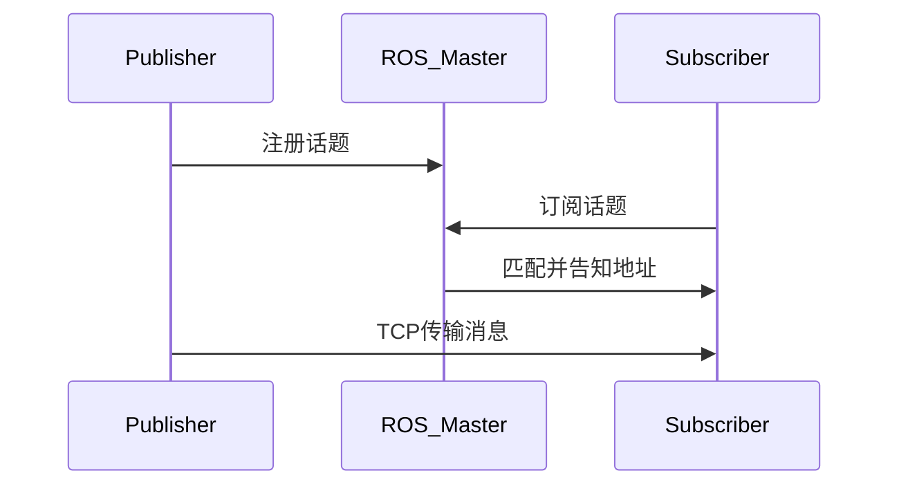
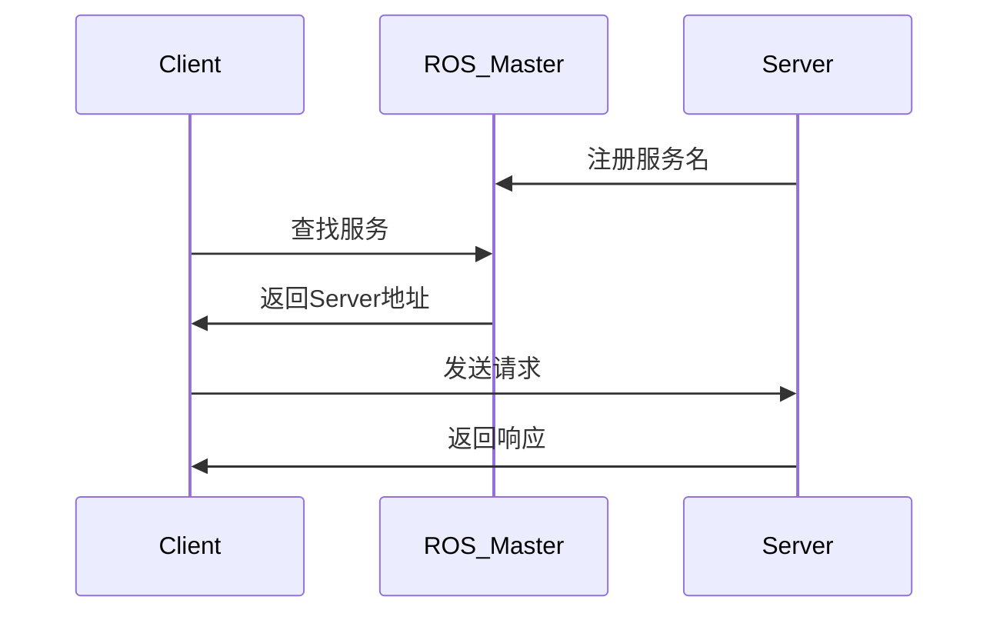

本文把以下 8 篇 ROS 教程按“技术文档”的阅读顺序合并成一篇：环境部署、工作空间、Topic/Service/Param、launch 管理、turtlesim Demo、C++ API 参考。

各章命令速查已统一到文末 [附录：命令速查](#appendixCommands)；遇到问题先看 [附录：常见问题](#appendixFaq)。

---

<a id="ch00"></a>
## 0. 导读与全局观

> 更新：2026-06-05

---

**ROS（Robot Operating System）** 不是传统意义上的操作系统，而是一套 **机器人软件开发框架**，运行在 Linux（常见 Ubuntu）上。它帮你解决：

- 传感器、执行器如何接入（驱动与硬件抽象）
- 多个程序（节点）之间如何通信（Topic / Service / Param）
- 代码如何组织、编译、复用（工作空间与功能包）

**一句话**：ROS = 让多个程序像搭积木一样协作，完成感知、决策、控制。

本文基于 **ROS 1 Noetic + Ubuntu 20.04**。

### 学习路线（建议按顺序）


### 三种通信机制对比（先建立选择标准）

ROS 节点之间常用三种方式交换数据，**不要混用场景**：

| 机制 | 模式 | 数据特点 | 典型用途 |
|------|------|----------|----------|
| **Topic** | 发布-订阅，异步 | 连续、单向流 | 雷达点云、速度指令、图像 |
| **Service** | 请求-响应，同步 | 一次一问一答 | 计算、查询、触发动作 |
| **Param** | 键值对 | 静态配置，不频繁改 | PID 参数、话题名、标定值 |

**怎么选？**

- 传感器 **一直发数据** → Topic
- **问一次、答一次** → Service
- **配置文件式** 的全局常量 → Param

### ROS 系统层次（建立全局观）

```
多台主机
  └── 工作空间 (workspace)
        └── 功能包 (package)
              └── 节点 (node)
                    └── 话题 / 服务 / 参数
```

- **roscore**：必须先启动，相当于「电话总机」（ROS Master）
- **rosrun**：启动单个节点
- **roslaunch**：按 launch 文件批量启动节点并设参数

> 接下来从“能跑起来”开始：先把 Ubuntu + ROS Noetic 安装好，再进入工作空间与通信机制。

---

<a id="ch01"></a>
## 1. 环境部署（Ubuntu + Noetic）

> 更新：2026-06-04

---

### 本章你要学什么

**本章解决什么问题**：ROS 基于 Linux，Windows 用户需要先有一个 Ubuntu 环境，再安装 ROS。

**学完能做什么**：选定部署方式、完成 ROS Noetic 安装，并用 `rosversion -d` 与 `roscore` 验证。

### 核心概念

| 项目 | 说明 |
|------|------|
| ROS 1 Noetic | 对应 Ubuntu 20.04 的 ROS 版本（本文使用） |
| roscore | ROS Master，几乎所有节点运行前要先启动 |
| source setup.bash | 加载 ROS 环境变量，否则找不到 `rosrun` 等命令 |

---

### 1. 场景一：选择 Ubuntu 部署方式

#### 场景

你在 Windows 电脑上学习 ROS，需要选一个能跑 Ubuntu 的方案。

#### 实操

| 部署方式 | 优势 | 劣势 | 适用场景 |
|----------|------|------|----------|
| **双系统** | 性能最佳，硬件直通 | 切换系统不便 | 长期开发、需要高性能 |
| **虚拟机** | 与 Windows 交互方便 | 性能有损耗 | 学习、测试 |
| **WSL 2** | 启动快、与 Windows 集成好 | 图形/硬件支持有限 | **新手推荐** |

**新手推荐路径**：Windows 10/11 → **WSL 2 + Ubuntu 20.04** → **ROS Noetic**

#### 小结

- 快速入门选 WSL 2；需要 RViz/Gazebo 重度仿真可考虑虚拟机或双系统。
- Ubuntu 与 ROS 版本要匹配：20.04 → Noetic。

---

### 2. 场景二：WSL 2 安装 Ubuntu（推荐）

#### 场景

Windows 10/11 用户，希望最快搭好 Linux 环境。

#### 实操

以管理员身份打开 PowerShell 或 Windows Terminal：

```bash
# 安装 WSL 和 Ubuntu 20.04
wsl --install -d Ubuntu-20.04
```

安装完成后设置 Linux 用户名和密码，验证：

```bash
wsl --list --verbose          # 查看发行版，VERSION 应为 2
wsl --set-default Ubuntu-20.04
```

常用维护命令：

```bash
wsl --shutdown    # 关闭 WSL
wsl --update      # 更新 WSL 内核
```

若版本为 WSL 1，可升级：

```bash
wsl --set-version Ubuntu-20.04 2
```

#### 小结

WSL 2 是本文默认假设环境；图形界面需 WSLg（Win11）或 X11 转发。

---

### 3. 场景三：虚拟机 / 双系统（可选）

#### 场景

WSL 无法满足图形仿真或硬件需求时。

#### 实操

**虚拟机**：安装 VMware 或 VirtualBox，分配至少 4GB 内存、40GB 磁盘，安装 Ubuntu 20.04 ISO。

**双系统**：用 [Rufus](https://rufus.ie/zh/) 制作启动盘，BIOS 设 U 盘启动，安装时选「与 Windows 共存」。安装前备份数据，预留至少 50GB。

#### 小结

虚拟机适合「边用 Windows 边学 ROS」；双系统适合长期、高性能开发。

---

### 4. 场景四：安装 ROS Noetic

#### 场景

Ubuntu 20.04 已就绪，需要安装 ROS 并验证。

#### 实操

**方式一：一键安装（推荐）**

```bash
wget http://fishros.com/install -O fishros && . fishros
```

脚本会检测系统并安装对应 ROS 版本、配置环境变量。

**方式二：手动安装**

参考你常用的官方/博客安装流程即可，关键是环境变量要写对。

**写入环境变量（重要）**

```bash
echo "source /opt/ros/noetic/setup.bash" >> ~/.bashrc
source ~/.bashrc
```

**验证安装**

```bash
rosversion -d          # 应输出 noetic
echo $ROS_DISTRO       # 应输出 noetic
```

**Smoke test：启动 roscore**

终端 1：

```bash
roscore
```

看到 `started core service [/rosout]` 且无报错即成功。`Ctrl+C` 结束。

#### 常见错误排查

| 现象 | 原因 | 处理 |
|------|------|------|
| `rosrun: command not found` | 未 source | `source /opt/ros/noetic/setup.bash` |
| WSL 无图形 | 默认无 X | Win11 用 WSLg，或配置 X11 |
| 虚拟机卡顿 | 资源不足 | 开启 VT-x，增加内存/CPU |

#### 小结

安装成功的标志：`rosversion -d` → `noetic`，`roscore` 能稳定启动。

> 环境就绪后，下一步要“有地方放代码、能编译、能运行”——这就是工作空间与 catkin。

---

<a id="ch02"></a>
## 2. 工作空间与 catkin 编译

> 更新：2026-06-04

---

### 本章你要学什么

**本章解决什么问题**：ROS 代码必须放在工作空间里，用 catkin 编译后才能 `rosrun`。

**学完能做什么**：创建工作空间、新建功能包、写 Hello World 节点、编译并运行。

### 核心概念

```
工作空间/
├── src/      # 源码与功能包
├── build/    # 编译中间文件（自动生成）
└── devel/    # 可执行文件与环境脚本（自动生成）
```


---

### 1. 场景一：创建并初始化工作空间

#### 场景

第一次在本机搭建 ROS 开发目录。

#### 实操

```bash
mkdir -p ~/ros/src
cd ~/ros
catkin_make
```

成功后目录结构：

```
ros/
├── build/
├── devel/
└── src/
```

#### 小结

`catkin_make` 必须在工作空间**根目录**执行，它会扫描 `src/` 下所有功能包。

---

### 2. 场景二：创建功能包

#### 场景

在工作空间里新增一个可编译、可运行的包。

#### 实操

```bash
cd ~/ros/src
catkin_create_pkg my_package roscpp rospy std_msgs
```

参数说明：

| 参数 | 含义 |
|------|------|
| `my_package` | 包名（小写、数字、下划线） |
| `roscpp` / `rospy` | C++ / Python 客户端库 |
| `std_msgs` | 标准消息类型 |

生成结构：

```
my_package/
├── CMakeLists.txt
├── package.xml
├── include/
└── src/
```

#### 小结

包名需唯一，勿与系统已安装包重名。

---

### 3. 场景三：编写并配置 Hello World 节点

#### 场景

在功能包内添加第一个 C++ 或 Python 节点。

#### 实操

**C++**（`src/hello.cpp`）：

```cpp
#include "ros/ros.h"

int main(int argc, char *argv[])
{
    ros::init(argc, argv, "hello_node");
    ros::NodeHandle nh;
    ROS_INFO("Hello World from ROS!");
    return 0;
}
```

**Python**（`scripts/hello.py`）：

```bash
mkdir -p my_package/scripts
chmod +x my_package/scripts/hello.py
```

```python
#!/usr/bin/env python
# -*- coding: utf-8 -*-

import rospy

if __name__ == "__main__":
    rospy.init_node("hello_node")
    rospy.loginfo("Hello World from ROS!")
```

在**功能包**的 `CMakeLists.txt` 中添加：

```cmake
add_executable(hello src/hello.cpp)
add_dependencies(hello ${${PROJECT_NAME}_EXPORTED_TARGETS} ${catkin_EXPORTED_TARGETS})
target_link_libraries(hello ${catkin_LIBRARIES})

catkin_install_python(
  PROGRAMS scripts/hello.py
  DESTINATION ${CATKIN_PACKAGE_BIN_DESTINATION}
)
```

> 注意：编辑的是**功能包内**的 `CMakeLists.txt`，不是工作空间根目录的。

#### 小结

C++ 需 `add_executable` + 链接；Python 需可执行权限 + `catkin_install_python`。

---

### 4. 场景四：编译工作空间

#### 场景

修改源码或 CMake 后，需要重新编译。

#### 实操

```bash
cd ~/ros
catkin_make
```

安装缺失依赖：

```bash
rosdep install --from-paths src --ignore-src -r -y
```

#### 常见错误排查

| 现象 | 原因 | 处理 |
|------|------|------|
| `Unable to find package` | 未安装依赖 | `rosdep install ...` |
| `rosrun` 找不到包 | 未 source | `source devel/setup.bash` |
| 修改 CMake 后仍报错 | 缓存问题 | `rm -rf build devel && catkin_make` |
| Python 脚本无法运行 | 无执行权限 | `chmod +x scripts/*.py` |

#### 小结

改 `CMakeLists.txt` 或 `package.xml` 后必须重新 `catkin_make`。

---

### 5. 场景五：运行节点

#### 场景

编译完成，要启动第一个自建节点。

#### 实操

终端 1 — 启动 Master：

```bash
roscore
```

终端 2 — 加载环境并运行：

```bash
cd ~/ros
source devel/setup.bash
rosrun my_package hello        # C++
rosrun my_package hello.py     # Python
```

**自动加载环境（推荐）**：

```bash
echo "source ~/ros/devel/setup.bash" >> ~/.bashrc
source ~/.bashrc
```

#### 小结

流程固定：`roscore` → `source` → `rosrun 包名 可执行文件名`。

> 工作空间跑通后，才进入“节点之间如何传数据”。先从最常用的 Topic（发布-订阅）开始。

---

<a id="ch03"></a>
## 3. 话题通信（Topic）

> 更新：2026-06-04

---

### 本章你要学什么

**本章解决什么问题**：传感器、控制指令等**连续数据**如何在节点间传递。

**学完能做什么**：编写 Publisher / Subscriber，定义自定义 msg，用 `rostopic` 调试。

### 核心概念

话题通信 = **发布-订阅**，异步、单向、适合数据流。

| 对比 | Topic | Service |
|------|-------|---------|
| 模式 | 发布-订阅 | 请求-响应 |
| 数据 | 连续流 | 一次一问一答 |
| 典型 | 雷达、速度指令 | 计算、查询 |



---

### 1. 场景一：理解话题通信流程

#### 场景

激光雷达节点持续发点云，导航节点订阅处理——这就是 Topic。

#### 实操

实现流程（6 步）：

1. **Talker 注册**：发布者向 Master 注册话题名  
2. **Listener 注册**：订阅者向 Master 注册要订阅的话题  
3. **Master 匹配**：Master 配对双方  
4. **Listener 请求连接**：订阅者向发布者发 TCP 连接请求  
5. **Talker 确认**：发布者返回地址  
6. **传消息**：建立 TCP 后直接通信（此后可关闭 Master，通信仍继续）

#### 小结

- 发布者与订阅者启动顺序无要求，但**后连上的订阅者可能丢早期消息**（可在发布前 `sleep` 几秒缓解）。
- 一个话题可有多个发布者、多个订阅者。

---

### 2. 场景二：运行示例

#### 场景

快速验证 Topic 是否工作。

#### 实操

```bash
cd ~/ros && catkin_make && source devel/setup.bash
```

终端 1：`roscore`  
终端 2：`rosrun topic advertiser`（或 `advertiser.py`）  
终端 3：`rosrun topic subscriber`（或 `subscriber.py`）

命令行调试：

```bash
rostopic list
rostopic echo /chat
rostopic pub /chat std_msgs/String "data: 'hello'"
```

#### 小结

话题名必须一致；用 `rostopic list` 核对实际名称。

---

### 3. 场景三：自定义消息类型（msg）

#### 场景

标准 `std_msgs` 不够用，需要自定义结构。

#### 实操

在功能包下创建 `msg/Person.msg`：

```txt
string name
uint16 age
float64 height
```

**package.xml** 添加：

```xml
<build_depend>message_generation</build_depend>
<exec_depend>message_runtime</exec_depend>
```

**CMakeLists.txt** 添加：

```cmake
find_package(catkin REQUIRED COMPONENTS roscpp rospy std_msgs message_generation)

add_message_files(FILES Person.msg)

generate_messages(DEPENDENCIES std_msgs)

catkin_package(CATKIN_DEPENDS roscpp rospy std_msgs message_runtime)
```

编译后使用：

```cpp
#include "topic/Person.h"   // C++
```

```python
from topic.msg import Person  # Python
```

#### 小结

msg 定义 → 改 package.xml + CMakeLists.txt → `catkin_make` → 引用生成的头文件/模块。

---

### 4. 场景四：编写 Publisher / Subscriber

#### 场景

从零写一个最小话题通信对。

#### 实操

**Publisher（C++ 要点）**：

```cpp
ros::init(argc, argv, "talker");
ros::NodeHandle nh;
ros::Publisher pub = nh.advertise<std_msgs::String>("chat", 10);
ros::Rate rate(10);
while (ros::ok()) {
    std_msgs::String msg;
    msg.data = "hello";
    pub.publish(msg);
    rate.sleep();
}
```

**Subscriber（C++ 要点）**：

```cpp
void cb(const std_msgs::String::ConstPtr& msg) {
    ROS_INFO("%s", msg->data.c_str());
}
ros::Subscriber sub = nh.subscribe("chat", 10, cb);
ros::spin();
```

#### 小结

Publisher 用循环 + `publish`；Subscriber 用回调 + `spin()`。`spin/spinOnce` 的选择见 [第 8 章](#ch08)。

> Topic 解决“连续数据流”。当你需要“问一次、答一次”的同步交互（计算/查询/触发动作），就该用 Service。

---

<a id="ch04"></a>
## 4. 服务通信（Service）

> 更新：2026-06-04

---

### 本章你要学什么

**本章解决什么问题**：需要**同步**完成一次计算或查询，而不是持续发数据。

**学完能做什么**：编写 Server / Client，定义 srv，用 `rosservice call` 测试。

### 核心概念

| 对比 | Topic | Service |
|------|-------|---------|
| 模式 | 发布-订阅（异步） | 请求-响应（同步） |
| 流向 | 单向 | 双向 |
| 场景 | 传感器流、控制流 | 加法、状态查询、触发动作 |



---

### 1. 场景一：理解服务通信流程

#### 场景

客户端问「3+4 等于几」，服务端算完返回 7。

#### 实操

5 步流程：

1. Server 向 Master 注册服务名  
2. Client 向 Master 注册要调用的服务名  
3. Master 匹配并告知 Client Server 地址  
4. Client 通过 TCP 发送请求  
5. Server 处理并返回响应  

#### 小结

- 客户端会**阻塞等待**响应。
- 服务端必须先启动，或 Client 用 `waitForService()` 等待。

---

### 2. 场景二：运行示例

#### 场景

验证加法服务 AddInts。

#### 实操

```bash
cd ~/ros && catkin_make && source devel/setup.bash
```

终端 1：`roscore`  
终端 2：`rosrun services server`  
终端 3：`rosrun services client 3 4`

命令行调用：

```bash
rosservice list
rosservice info /AddInts
rosservice call /AddInts "num1: 5
num2: 10"
```

#### 小结

服务名以 `/` 开头；请求格式需与 srv 定义一致。

---

### 3. 场景三：自定义服务类型（srv）

#### 场景

标准服务类型不满足需求。

#### 实操

创建 `srv/AddInts.srv`：

```txt
# 请求
int32 num1
int32 num2
---
# 响应
int32 sum
```

`---` 上方是请求，下方是响应。

配置与 msg 类似，在 CMakeLists.txt 中用 `add_service_files`：

```cmake
add_service_files(FILES AddInts.srv)
generate_messages(DEPENDENCIES std_msgs)
```

编译后：

```cpp
#include "services/AddInts.h"
```

```python
from services.srv import AddInts, AddIntsRequest
```

#### 小结

srv 格式固定：请求 + `---` + 响应。

---

### 4. 场景四：编写 Server / Client

#### 场景

实现一个最小服务对。

#### 实操

**Server 回调**：

```cpp
bool add( services::AddInts::Request &req,
          services::AddInts::Response &res) {
    res.sum = req.num1 + req.num2;
    return true;  // true 表示处理成功
}
ros::ServiceServer server = nh.advertiseService("AddInts", add);
ros::spin();
```

**Client 调用**：

```cpp
ros::ServiceClient client = nh.serviceClient<services::AddInts>("AddInts");
client.waitForExistence();
services::AddInts srv;
srv.request.num1 = 3;
srv.request.num2 = 4;
if (client.call(srv)) {
    ROS_INFO("sum=%d", srv.response.sum);
}
```

#### 小结

Server 用 `advertiseService` + `spin`；Client 用 `serviceClient` + `call`，记得 `waitForExistence`。

> Service 适合交互/查询/触发动作。但“配置类数据”不应该走 Topic/Service——那是参数服务器（Param）的职责。

---

<a id="ch05"></a>
## 5. 参数服务器（Param）

> 更新：2026-06-04

---

### 本章你要学什么

**本章解决什么问题**：多个节点需要共享**配置类、不频繁变化**的数据（PID、话题名、标定值）。

**学完能做什么**：用 C++ / 命令行读写参数，理解全局 / 相对 / 私有命名空间。

### 核心概念

参数服务器 = ROS Master 内的**键值字典**，全局可见（受命名空间影响）。

| 机制 | 用途 |
|------|------|
| Topic | 连续数据流 |
| Service | 一次请求-响应 |
| **Param** | **静态配置、键值对** |

> 不要用 Param 做高频读写或大块数据传输。

---

### 1. 场景一：参数命名空间

#### 场景

多节点部署时避免参数名冲突。

#### 实操

| 写法 | 含义 | 示例 |
|------|------|------|
| `/name` | 全局参数 | `/global_param_int` |
| `name` | 相对当前命名空间 | `relative_param_int` |
| `~name` | 节点私有参数 | `~private_param_int` |

```cpp
ros::param::set("/global_param_int", 20000);
ros::param::set("relative_param_int", 20000);
ros::param::set("~private_param_int", 20000);

ros::NodeHandle nh_private("~");
nh_private.setParam("private_param_int_v2", 20000);
```

#### 小结

launch 中 `<node>` 内的 `<param>` 通常是该节点的私有参数。

---

### 2. 场景二：设置与修改参数

#### 场景

启动前或运行时写入配置。

#### 实操

两套等价 API：`ros::NodeHandle` 成员函数 或 `ros::param` 静态函数。

```cpp
// NodeHandle 方式
nh.setParam("nh_int", 10);
nh.setParam("nh_int", 10000);  // 同键再次 set = 修改

// ros::param 方式
ros::param::set("param_int", 20);
ros::param::set("param_double", 3.14);
ros::param::set("param_bool", false);
ros::param::set("param_string", "hello");
```

运行示例：

```bash
roscore
rosrun params param_set
```

#### 小结

新增与修改用同一 API；键已存在则覆盖。

---

### 3. 场景三：查询与删除参数

#### 场景

读取配置或清理无用参数。

#### 实操

**查询**：

```cpp
int val;
if (nh.getParam("nh_int", val)) {
    ROS_INFO("nh_int=%d", val);
}
int def = nh.param("missing_key", 999);  // 不存在则返回默认值

std::vector<std::string> names;
ros::param::getParamNames(names);
```

**删除**：

```cpp
ros::param::del("param_double");       // 成功 true，不存在 false
nh.deleteParam("nh_int");
```

运行：

```bash
rosrun params param_get
rosrun params param_del
rosparam list
rosparam get nh_int
```

#### 小结

`getParamCached` 适合反复读同一参数；`hasParam` / `searchParam` 用于存在性检查。

---

### 4. 场景四：命令行管理参数

#### 场景

不改代码，快速查看或临时改参。

#### 实操

```bash
rosparam list
rosparam get /global_param_int
rosparam set /test_param 42
rosparam delete /test_param
rosparam dump params.yaml    # 导出
rosparam load params.yaml    # 导入
```

launch 中批量加载：

```xml
<rosparam file="$(find pkg)/config/params.yaml" command="load" />
```

#### 小结

Param 适合 launch 一次性加载 YAML；运行时调试可用 `rosparam`。

> 参数与命名空间一旦进入“多节点/多机/多份 launch”场景，管理复杂度会陡增。下一章把这些管理问题一次解决：roslaunch、重名处理、overlay、多机通信。

---

<a id="ch06"></a>
## 6. Launch 与系统管理

> 更新：2026-06-04

---

### 本章你要学什么

**本章解决什么问题**：节点多了以后，如何一键启动、避免重名、管理参数、跨主机通信。

**学完能做什么**：写 launch 文件、用命名空间/remap 解决冲突、配置多机 ROS。

### 核心概念

```
多台主机 → 工作空间 → 功能包 → 节点 → 话题/服务/参数
```

大型系统中常见问题：节点太多难启动、名称冲突、多机通信——本章逐一解决。

---

### 1. 场景一：元功能包（Metapackage）

#### 场景

项目有 `topic`、`params`、`services` 多个包，希望一次依赖全部引入。

#### 实操

```bash
cd ~/ros/src
catkin_create_pkg meta_package
```

**package.xml** 关键配置：

```xml
<exec_depend>topic</exec_depend>
<exec_depend>params</exec_depend>
<exec_depend>services</exec_depend>
<export>
  <meta_package />
</export>
```

**CMakeLists.txt**：

```cmake
cmake_minimum_required(VERSION 3.0.2)
project(meta_package)
find_package(catkin REQUIRED)
catkin_metapackage()
```

其他包只需 `<exec_depend>meta_package</exec_depend>` 即可依赖全部子包。

#### 小结

元功能包不含源码，只做依赖聚合，方便打包分发。

---

### 2. 场景二：launch 文件最小示例

#### 场景

一次启动 roscore 依赖的多个节点并设参数。

#### 实操

最小 launch（`sample.launch`）：

```xml
<launch>
  <node pkg="manage" type="sample_node" name="sample" output="screen" />
</launch>
```

逐步扩展——加参数：

```xml
<launch>
  <param name="global_param" value="100" />
  <node pkg="manage" type="sample_node" name="sample" output="screen">
    <param name="private_param" value="200" />
  </node>
</launch>
```

加 remap：

```xml
<node pkg="topic" type="subscriber" name="subscriber_node">
  <remap from="chat_relative" to="test_ns/chat_relative" />
</node>
```

运行：

```bash
roslaunch manage sample.launch
```

> `roslaunch` 不保证按文件中顺序启动节点（多进程并发）。

#### 小结

`<node>` 内 `<param>` 为私有参数；顶层 `<param>` 为全局参数。

---

### 3. 场景三：重名处理

#### 场景

两台机器人各有一个 `listener` 节点，或话题名相同导致串线。

#### 实操

**节点重名**——用命名空间：

```xml
<group ns="robot1">
  <node pkg="topic" type="subscriber" name="listener" />
</group>
<group ns="robot2">
  <node pkg="topic" type="subscriber" name="listener" />
</group>
```

实际节点名：`/robot1/listener`、`/robot2/listener`。

命令行等价：`rosrun manage subscriber __ns:=/robot1`

**话题重名**——用 remap：

```xml
<remap from="chat_relative" to="test_ns/chat_relative" />
```

或：`rosrun manage subscriber /chat_relative:=/subscriber_node/chat_relative`

**参数重名**——用 `/` 全局、`~` 私有、`/ns1/` 自定义命名空间。

| 对象 | 冲突表现 | 解决 |
|------|----------|------|
| 节点 | 后启动顶掉先启动 | `ns` 或不同 `name` |
| 话题 | 订阅错数据源 | `remap` 或 `ns` |
| 参数 | 读到错误配置 | 全局/私有/命名空间 |

#### 小结

源码用相对话题名，launch 里用 `ns` + `remap` 组合出最终结构。

---

### 4. 场景四：工作空间覆盖（Overlay）

#### 场景

同时 source 系统 ROS 和自研工作空间。

#### 实操

```bash
source /opt/ros/noetic/setup.bash   # 底层
source ~/ros/devel/setup.bash       # 上层，优先
```

**后 source 的覆盖先 source 的**。同名包/可执行文件以顶层为准。

排查实际加载：

```bash
rospack find topic
which rosrun
```

#### 小结

开发时明确分层：底层依赖 vs 当前项目，避免版本混乱。

---

### 5. 场景五：分布式多机通信

#### 场景

嵌入式板跑控制，PC 跑可视化和算法。

#### 实操

1. 各主机网络互通（`ping`），在 `/etc/hosts` 互加 IP 与主机名  
2. 所有主机设置相同环境变量（`~/.bashrc`）：

```bash
export ROS_MASTER_URI=http://主控机IP:11311
export ROS_HOSTNAME=本机IP
```

3. 主控机运行 `roscore`，其他机器正常 `rosrun` / `roslaunch`

调试：

```bash
env | grep ROS_
rosnode list
rostopic list
rqt_graph
```

#### 小结

`ROS_MASTER_URI` 必须指向运行 roscore 的那台机器；`ROS_HOSTNAME` 为本机可被访问的 IP。

> 有了 launch 管理与命名空间，你已经具备“组织一个小系统”的能力了。下一章用 ROS 自带的 turtlesim，做一次把 Topic + Service 串起来的综合 Demo。

---

<a id="ch07"></a>
## 7. turtlesim 综合 Demo

> 更新：2026-06-04

---

### 本章你要学什么

**本章解决什么问题**：前面各章概念分散，需要一个小项目把它们串起来。

**学完能做什么**：用 Topic 控制小海龟、订阅位姿、用 Service 生成新海龟。

### 核心概念

| 接口 | 类型 | 用途 |
|------|------|------|
| `/turtle1/cmd_vel` | Topic (`geometry_msgs/Twist`) | 发布速度指令 |
| `/turtle1/pose` | Topic (`turtlesim/Pose`) | 订阅位姿 |
| `/spawn` | Service (`turtlesim/Spawn`) | 生成新海龟 |

---

### 1. 场景一：完整实操清单

#### 场景

从零跑通 turtlesim 综合 Demo。

#### 实操

**Step 1 — 编译**

```bash
cd ~/ros && catkin_make && source devel/setup.bash
```

**Step 2 — 启动 roscore**

```bash
roscore
```

**Step 3 — 启动 turtlesim**

```bash
rosrun turtlesim turtlesim_node
```

验证接口：

```bash
rostopic list    # 应有 /turtle1/cmd_vel、/turtle1/pose
rosservice list  # 应有 /spawn
```

**Step 4 — 发布速度（让小海龟转圈）**

```bash
rosrun demo pub_twist.py    # Python
# 或
rosrun demo pub_twist       # C++
```

**Step 5 — 订阅位姿**

```bash
rosrun demo sub_pose
```

**Step 6 — 调用 spawn 生成新海龟**

```bash
rosrun demo client_request.py
```

也可命令行：

```bash
rosservice call /spawn "x: 3.0
y: 4.0
theta: 3.14
name: 'turtle4'"
```

#### 小结

推荐顺序：`roscore` → `turtlesim_node` → 发速度 → 订位姿 → 调 spawn。

---

### 2. 场景二：发布速度指令（Topic）

#### 场景

以 10Hz 发布 `Twist`，让小海龟做圆周运动。

#### 实操

**Python**（`src/demo/scripts/pub_twist.py`）：

```python
#!/usr/bin/env python
"""话题：/turtle1/cmd_vel  类型：geometry_msgs/Twist"""
import rospy
from geometry_msgs.msg import Twist

if __name__ == '__main__':
    rospy.init_node("pub_twist_p")
    pub = rospy.Publisher("/turtle1/cmd_vel", Twist, queue_size=10)
    rate = rospy.Rate(10)
    twist = Twist()
    twist.linear.x = 1.0
    twist.angular.z = 1.0

    while not rospy.is_shutdown():
        pub.publish(twist)
        rate.sleep()
```

**C++**（`src/demo/src/pub_twist.cpp`）要点：

```cpp
ros::Publisher pub = nh.advertise<geometry_msgs::Twist>("turtle1/cmd_vel", 10);
geometry_msgs::Twist twist;
twist.linear.x = 1.0;
twist.angular.z = 1.0;
while (ros::ok()) {
    pub.publish(twist);
    rate.sleep();
    ros::spinOnce();
}
```

#### 小结

`linear.x` 控制前进速度，`angular.z` 控制转角；两者配合产生圆弧轨迹。

---

### 3. 场景三：订阅位姿（Topic）

#### 场景

实时打印小海龟位置和速度。

#### 实操

**C++**（`src/demo/src/sub_pose.cpp`）：

```cpp
void get_pose(const turtlesim::Pose::ConstPtr &pose) {
    ROS_INFO("x=%.2f, y=%.2f, theta=%.2f, lin=%.2f, ang=%.2f",
        pose->x, pose->y, pose->theta,
        pose->linear_velocity, pose->angular_velocity);
}

int main(int argc, char *argv[]) {
    ros::init(argc, argv, "sub_pose");
    ros::NodeHandle nh;
    ros::Subscriber sub = nh.subscribe("/turtle1/pose", 100, get_pose);
    ros::spin();
    return 0;
}
```

与发布节点同时运行，可观察位姿随时间变化。

#### 小结

纯订阅节点用 `ros::spin()` 阻塞等待回调，详见 [第 8 章](#ch08)。

---

### 4. 场景四：生成新海龟（Service）

#### 场景

在指定位置 spawn 第二只海龟。

#### 实操

**Python**（`src/demo/scripts/client_request.py`）：

```python
#!/usr/bin/env python
"""服务：/spawn  类型：turtlesim/Spawn"""
import rospy
from turtlesim.srv import Spawn, SpawnRequest

if __name__ == '__main__':
    rospy.init_node("new_turtle_p")
    client = rospy.ServiceProxy("/spawn", Spawn)

    spawn = SpawnRequest()
    spawn.x = 3.0
    spawn.y = 4.0
    spawn.theta = 3.14
    spawn.name = 'turtle4'

    client.wait_for_service()
    try:
        client.call(spawn)
        rospy.loginfo("Succeed")
    except Exception as e:
        rospy.logerr(e)
```

#### 小结

海龟名称在同一 `turtlesim_node` 中必须唯一；重复名称会导致 spawn 失败。

---

### 5. 场景五：扩展实验

#### 场景

加深理解，自由探索。

#### 实操

- 修改 `Twist` 的线速度、角速度，观察轨迹变化  
- 修改 spawn 的位置和名称，生成多只海龟  
- 同时运行发布、订阅、spawn 三个节点  
- 用 `rqt_graph` 查看节点关系  

#### 小结

turtlesim 是 ROS 官方自带的最小仿真环境，适合反复练手。

> 到这里你已经能写出一个“小而完整”的 ROS 项目。最后一章把 C++ 里最容易踩坑/最常用的 API 统一整理成速查表：init、latch、spin、时间相关 API。

---

<a id="ch08"></a>
## 8. C++ API 参考（查阅）

> 更新：2026-06-04

---

本章为查阅手册：写 C++ 节点时，init 选项、消息锁存、回调驱动、时间控制怎么选。

### API 速览

| API | 何时用 |
|-----|--------|
| `ros::init()` | 每个节点入口，必须调用 |
| `latch=true` | 新订阅者需要收到「最后一条」历史消息 |
| `ros::spin()` | 纯订阅/纯服务，无主循环 |
| `ros::spinOnce()` | 主循环里还要 publish 或做其他事 |
| `ros::Time/Duration/Rate/Timer` | 时刻、休眠、定频、定时回调 |

---

### 1. ros::init — 节点初始化

#### 何时用

每个 C++ 节点的 `main()` 第一行。

#### 最小示例

```cpp
ros::init(argc, argv, "my_node");
```

#### init_options

```cpp
ros::init(argc, argv, "pub_demo", ros::init_options::AnonymousName);
```

| 选项 | 说明 |
|------|------|
| `AnonymousName` | 节点名加随机后缀，允许多实例 |
| `NoSigintHandler` | 不处理 Ctrl+C，需自行退出 |
| `NoRosout` | 日志不发送到 `/rosout` |

组合：`AnonymousName \| NoRosout`

#### 注意点

- 节点名在同一 Master 下应唯一（或用 AnonymousName）
- `argc/argv` 用于接收 launch 中的 remap 参数

---

### 2. latch — 消息锁存

#### 何时用

地图、配置、状态等「不频繁更新、但新订阅者需要立即拿到最新值」的场景。

#### 最小示例

```cpp
ros::Publisher pub = nh.advertise<std_msgs::String>("map", 10, true);
//                                                          队列  latch
```

| latch | 行为 | 适用 |
|-------|------|------|
| `false`（默认） | 只收到订阅**之后**的消息 | 传感器流、速度指令 |
| `true` | 保存最后一条，新订阅者立即收到 | 地图、状态、配置 |

---

### 3. spin 与 spinOnce — 回调处理

#### 何时用

节点有 Subscriber、Service 或 Timer 时，**必须**调用 spin 系列，否则回调永不执行。

#### ros::spin() — 阻塞

```cpp
ros::Subscriber sub = nh.subscribe("test", 10, callback);
ros::spin();  // 阻塞，直到节点关闭
```

**适合**：纯订阅者、纯服务端。

#### ros::spinOnce() — 非阻塞

```cpp
ros::Rate rate(10);
while (ros::ok()) {
    pub.publish(msg);
    ros::spinOnce();  // 处理一次待处理回调
    rate.sleep();
}
```

**适合**：发布者主循环中还要处理订阅回调。

> 有回调却不 spin = 回调永远不执行。

---

### 4. 时间相关 API

#### ros::Time — 时刻

```cpp
ros::Time now = ros::Time::now();
ros::Time t1(100, 500000000);  // 100.5 秒
ROS_INFO("%.2f", now.toSec());
```

#### ros::Duration — 持续时间

```cpp
ros::Duration du(2.5);
du.sleep();  // 休眠 2.5 秒
```

#### 时间运算

```cpp
ros::Time later = now + du;           // Time ± Duration = Time
ros::Duration diff = t2 - t1;         // Time - Time = Duration
// Time + Time 不允许！
```

#### ros::Rate — 频率控制

```cpp
ros::Rate rate(10);  // 10 Hz
while (ros::ok()) {
    // ...
    rate.sleep();
}
```

#### ros::Timer — 定时器

```cpp
void timerCallback(const ros::TimerEvent& event) {
    ROS_INFO("Timer triggered!");
}
ros::Timer timer = nh.createTimer(
    ros::Duration(0.5), timerCallback, false);  // false=重复
ros::spin();  // Timer 回调也需要 spin
```

#### 注意点

必须先 `ros::NodeHandle nh`，时间系统才初始化。

---

### 5. 运行示例

```bash
cd ~/ros && catkin_make && source devel/setup.bash
roscore

# 终端1：发布者（latch + spinOnce）
rosrun manage advertiser

# 终端2：订阅者（spin）— 可延迟启动测试 latch
rosrun manage subscriber

# 终端3：时间 API
rosrun manage apis_example
```

---

<a id="appendixCommands"></a>
## 9. 附录：命令速查

### 环境 / WSL

| 命令 | 说明 |
|------|------|
| `wsl --install -d Ubuntu-20.04` | 安装 WSL + Ubuntu |
| `wsl --list --verbose` | 查看 WSL 发行版 |
| `rosversion -d` | 查看 ROS 版本 |
| `echo $ROS_DISTRO` | 查看当前 ROS 发行版名 |
| `roscore` | 启动 ROS Master |
| `source /opt/ros/noetic/setup.bash` | 加载 ROS 系统环境 |

### workspace / catkin

| 命令 | 说明 |
|------|------|
| `mkdir -p ~/ros/src` | 创建工作空间源码目录 |
| `catkin_make` | 编译工作空间 |
| `catkin_create_pkg 包名 依赖...` | 创建功能包 |
| `rosdep install --from-paths src --ignore-src -r -y` | 安装依赖 |
| `source devel/setup.bash` | 加载工作空间环境 |
| `rosrun 包名 节点名` | 运行节点 |

### rostopic / rosservice / rosparam

| 命令 | 说明 |
|------|------|
| `rostopic list` / `echo` / `pub` / `info` | 话题：列出 / 监听 / 发布 / 查看信息 |
| `rosservice list` / `info` / `type` / `call` | 服务：列出 / 查看信息 / 类型 / 调用 |
| `rosparam list` / `get` / `set` / `delete` | 参数：列出 / 读 / 写 / 删 |
| `rosparam dump/load` | 参数导出 / 导入 YAML |
| `rqt_graph` | 可视化通信图 |

### roslaunch / rosnode / overlay / 多机

| 命令 | 说明 |
|------|------|
| `roslaunch 包名 xxx.launch` | 批量启动 |
| `rosnode list` / `kill` | 查看 / 终止节点 |
| `rospack find 包名` | 查找包路径（确认 overlay） |
| `env \| grep ROS_` | 检查多机环境变量 |

### turtlesim Demo

| 命令 | 说明 |
|------|------|
| `rosrun turtlesim turtlesim_node` | 启动仿真 |
| `rosservice call /spawn ...` | spawn 新海龟 |
| `rostopic echo /turtle1/pose` | 命令行看位姿 |

---

<a id="appendixFaq"></a>
## 10. 附录：常见问题

| 问题 | 原因 | 处理 |
|------|------|------|
| `rosrun` 找不到包 | 未 source 工作空间 | `source ~/ros/devel/setup.bash` |
| 节点启动了但没数据 | 话题名不一致 | `rostopic list` / `rostopic info` 核对 |
| 编译找不到依赖 | 缺系统包 | `rosdep install --from-paths src --ignore-src -r -y` |
| 有回调但不触发 | 没调用 `spin/spinOnce` | 订阅/服务/定时器节点必须 spin |

